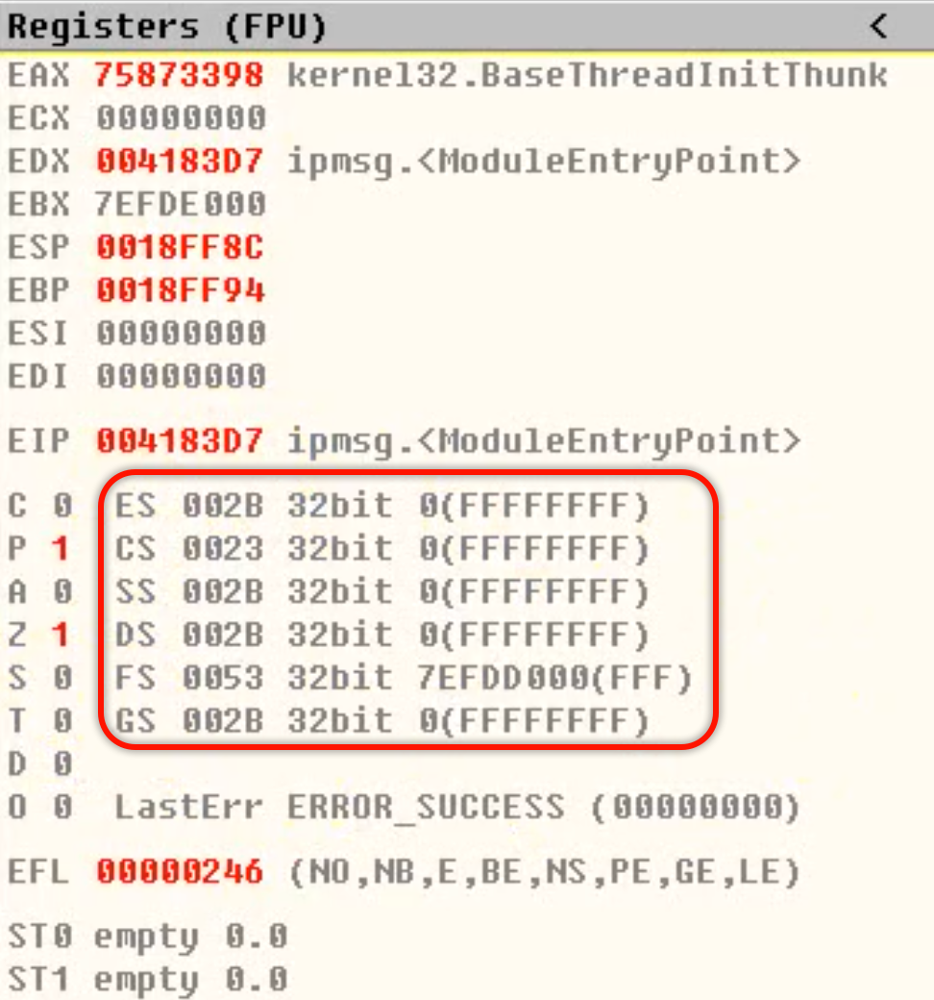
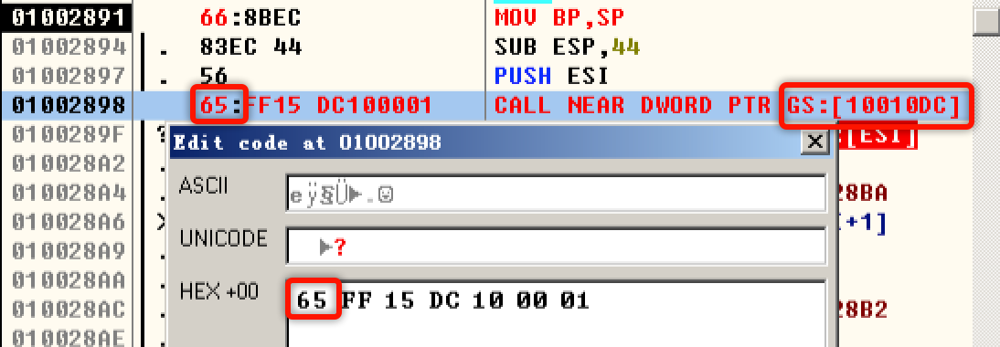
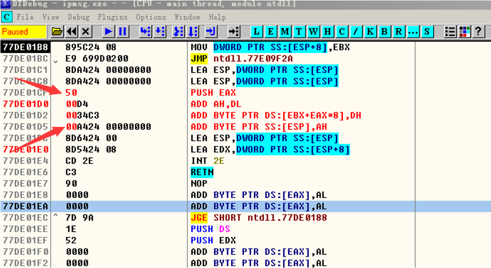
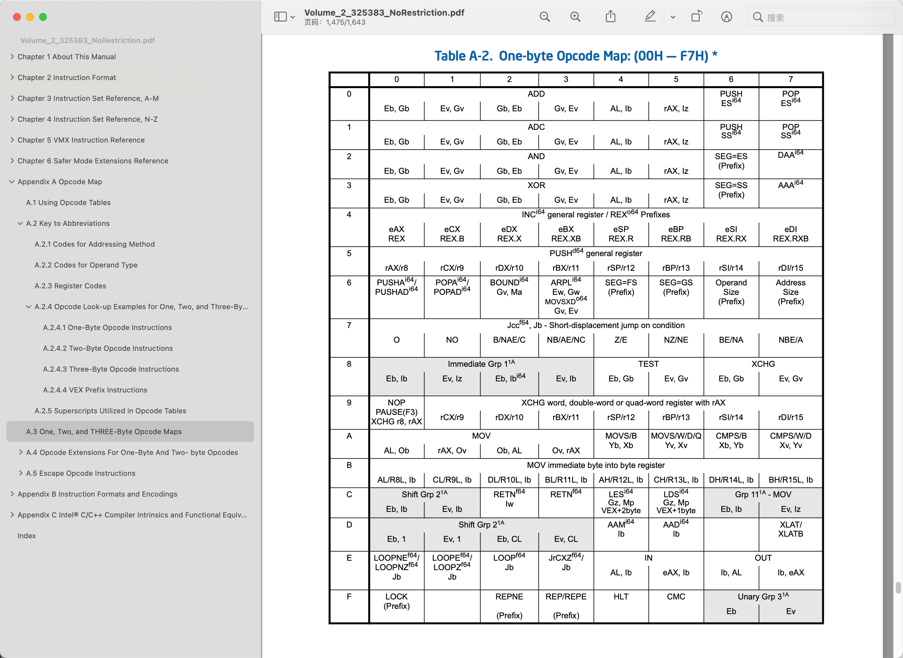
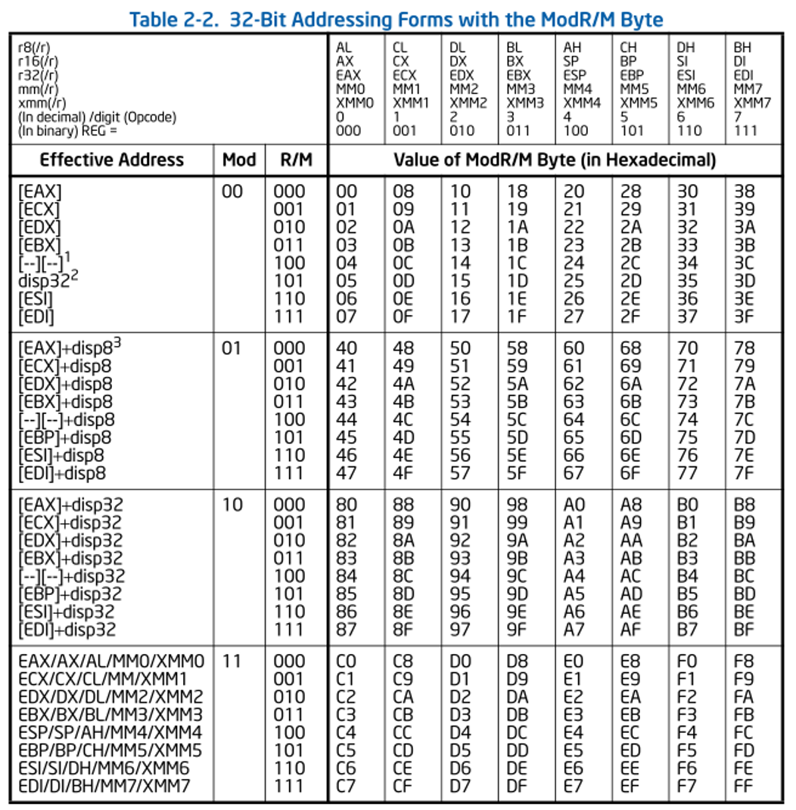
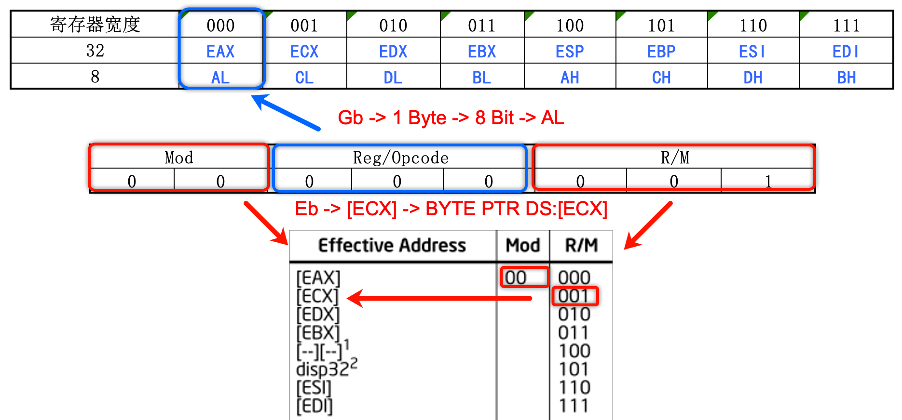
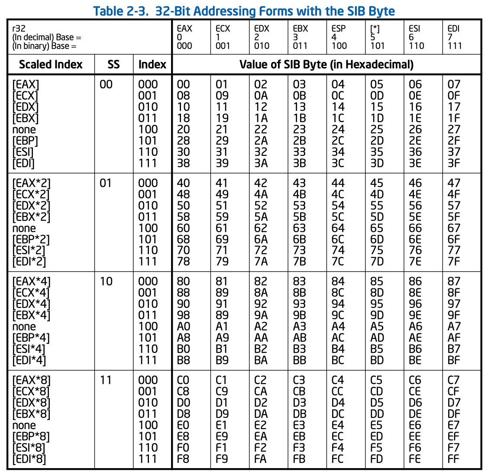

# 硬编码

# 硬编码概述

计算机只认识0和1,也就是二进制,任何一个可执行程序最终就是0和1组成,如果非要细分的化,可以分为两个部分:**数据和指令**,但是对于这两个部分没有明显的界限,如果你把某个地址给到CPU的EIP寄存器,这时候这个地址就会当成指令去执行,但是指令是有自己的格式,**如果你指向的地址没有按照指令的格式来,就会执行出错,换句话说,如果你指向的地址是一段数据,但是这个数据格式也是按照指令格式的,那么也就会去执行**.

指令的格式取决于你的CPU类型:X86、X64、Arm...而所谓的**硬编码就是机器码、指令**,本章节主要讲解的格式就是**X86的指令格式**.

如下图所示,是两个软件中打开着某个可执行文件(左 DTDebug,右 IDA),我们可以看见用红色方框,标记的部分就是硬编码,其右边是汇编指令,但实际上你所看见的这些汇编指令都是这些软件的反汇编引擎帮你**从硬编码转换而来的**(可执行文件并不会有这些东西,都是0和1).

所有与计算机底层相关的行业都需要深入学习、了解硬编码,例如病毒行业的**ShellCode**,反病毒行业的**特征码**,加密与破解行业的**指令壳、VMP**,外挂行业的**HOOK**以及反外挂行业的**提串**都离不开硬编码的学习.

# 前缀指令

如下图所示就是硬编码的结构,其有6个部分,我们现在所要了解的就是前缀指令,也就是第一部分.

我们可以在DTDebug中找到前缀指令,如下图所示在硬编码的区域在前缀指令之后**有一个":"冒号**,这是为了方便使用者使用:

## 前缀指令分组

上文中我们了解到硬编码的结构,在结构图中第一部分为前缀指令,前缀指令下面有一个描述是**"最多有四个前缀,每个前缀只能有1个字节"(并且途中表示前缀指令是可选的,所以前缀指令最少占0字节,最多占4字节)**,这也就表示这前缀指令是有分组的,**也就是四组,在前缀指令中每组只能出现一个**,分组如下所示:

- LOCK和REPEAT前缀指令:
  1. LOCK(**硬编码:**F0):LOCK是用来**锁地址总线**,例如01002891这个地址开头是LOCK指令,当前地址在**多核情况**下,只能有一个核CPU去读这个地址,其他核CPU是可以不读取的;
  2. REPNE/REPNZ(**硬编码:**F2):**REP\***就是我们之前汇编所学过的重复指令,在这里的NE或者NZ表示根据EFLAG标志寄存器ZF位为0的时候执行;
  3. REP/REPZ(**硬编码:**F3);重复指令,在这里Z表示根据EFLAG标志寄存器ZF位为1的时候执行.
- 段前缀指令
  - 这里的段实际上表示着**段寄存器**,如下英文字母都表示是寄存器:
    1. CS(**硬编码:**2E)
    2. SS(**硬编码:**36)
    3. DS(**硬编码:**3E)
    4. ES(**硬编码:**26)
    5. FS(**硬编码:**64)
    6. GS(**硬编码:**65)

- - 如下图所示为DTDebug中的段寄存器位置:

1. - 默认情况下你要使用段寄存器的地址不加段前缀指令时都为DS段寄存器的地址:

1. - 如果你想使用其他段寄存器就可以在这段硬编码之前加入对应段前缀指令(在DTDebug中选中需要修改的然后按快捷键**Ctrl+E**进行修改):

- 操作数宽度前缀指令,**硬编码:**66,其是用来改变操作数的宽度,这种改变是双向的,例如你当前操作数的宽度是32位的,当你在硬编码之前加上66,则操作数的宽度变成16位,反之如果你当前操作数的宽度是16位的,加上之后就会变成32位.
  - 例如在如下的程序中有一个硬编码55,对应的汇编就是PUSH EBP,这个EBP的宽度是32位的,**这里的宽度之所以是32位是因为当前CPU的模式是32位的**,想要知道当前CPU模式就需要涉及段寄存器的知识,这里我们简单了解下(后续课程深入了解),在段寄存器CS中有一个属性位称之为DB位,当DB位为1的时候当前CPU处于32位模式,为0的时候就表示当前CPU处于16位模式,所以在这里是32位的模式操作数也就是32为宽度.

- - 那如果你在32位的模式下去使用16位的寄存器,就可以在硬编码之前加上66:

- 地址宽度前缀指令,**硬编码:**67,其用来改变地址宽度,你可以与操作数宽度前缀指令一样去理解(**双向改变**),例如在32位模式下寻址默认是32位的地址宽度,但是当你在硬编码之前加上67之后,寻址就按照16位的地址宽度进行了:

**注意**:前缀指令使用的时候是没有顺序的.

# 定长指令与变长指令

如下图是硬编码的结构,第二部分的**Opcode是整个指令的灵魂**,硬编码结构中的任何部分都可以没有,但是Opcode是必须要有的.

Opcode最少1个字节,最多3个字节;如下图我们可以看见硬编码排列是不整齐的,有的一行是1个字节,有的则是2个、5个字节,**Opcode、ModR/M、SIB这三个组合在一块就可以决定一行指令的宽度(抛开前缀指令)**,后面的Displacement、Immediate就是配角,当前面的三个确定了,这两个也就确定了.

**Opcode、ModR/M、SIB**之间的关系是这样的:Opcode决定有没有ModR/M,ModR/M决定有没有SIB.

## 什么是定长、变长指令

如下图所示50、52之类的硬编码实际上就是**定长指令**,但并不表示定长指令就只有一个字节;同样,如00D4、0034C3之类的硬编码就是**变长指令**.

简而言之,**定长指令**可以直接通过Opcode确定硬编码长度,**变长指令**就无法通过Opcode确定硬编码长度.

## 如何区分指令是定长或变长

如何区分指令是定长或变长,这需要去根据官方的文档来看:

如下图所示展开到「A.3 ONE, TWO, AND THREE-BYTE OPCODE MAPS」,向下拉就可以看到一张表,这张表是1个字节的Opcode的对应表,但实际上其他字节的Opcode就是通过这张表进行扩展的,所以这张表就是主表,也是所有x86硬编码中最重要的一张表(**这张图中的表是不完整的,向下拉还有一张表,两张表拼在一块才是完整的**):

通过这张表,我们可以直接看到之前举例的定长指令50就正是对应着PUSH EAX,举一反三,51就是PUSH ECX...,图中的**rAX表示着这里可以是64位的RAX(64位模式下才有)、32位的EAX、16位的AX**,而**eAX则表示这里可以是32位的EAX、16位的AX(默认取决于你的CPU运行模式)**:

但是我们之前举例的变长指令00却让有点让人摸不着头脑:

这里我们知道对应的汇编代码是ADD,但是表格中的Eb,Gb却不清楚是什么;实际上这是Intel定义的一种Zz表示法,第一个字母为大写,第二个字母为小写.

在文档的「A.2.1 Codes for Addressing Method」、「A.2.2 Codes for Operand Type」中有解释每个字母的含义,

结合内容,再根据之前知道的Opcode决定有没有ModR/M,返过来一推,**Opcode后面有ModR/M则表示这是一个变长指令,没有则是一个定长指令**,也就是说操作数只要存在Ex或Gx的就为定长指令,没有的则为定长指令.

# 经典定长指令

经典定长指令,就是我们以后会经常见到、使用的定长指令;**注意以下都是以x86环境去讲解,在实际的硬编码对应的汇编指令中其他环境对应的指令并不是这些**.

## 修改ERX

标题中的ERX就表示EAX、ECX、EDX等等32位的寄存器.

### PUSH/POP

PUSH:压入栈;POP:推出堆.

| 定长指令 | 汇编代码 |
| -------- | -------- |
| 0x50     | PUSH EAX |
| 0x51     | PUSH ECX |
| 0x52     | PUSH EDX |
| 0x53     | PUSH EBX |
| 0x54     | PUSH ESP |
| 0x55     | PUSH EBP |
| 0x56     | PUSH ESI |
| 0x57     | PUSH EDI |
| 0x58     | POP EAX  |
| 0x59     | POP ECX  |
| 0x5A     | POP EDX  |
| 0x5B     | POP EBX  |
| 0x5C     | POP ESP  |
| 0x5D     | POP EBP  |
| 0x5E     | POP ESI  |
| 0x5F     | POP EDI  |

### INC/DEC

INC:加1;DEC:减1.

| 定长指令 | 汇编代码 |
| -------- | -------- |
| 0x40     | INC EAX  |
| 0x41     | INC ECX  |
| 0x42     | INC EDX  |
| 0x43     | INC EBX  |
| 0x44     | INC ESP  |
| 0x45     | INC EBP  |
| 0x46     | INC ESI  |
| 0x47     | INC EDI  |
| 0x48     | DEC EAX  |
| 0x49     | DEC ECX  |
| 0x4A     | DEC EDX  |
| 0x4B     | DEC EBX  |
| 0x4C     | DEC ESP  |
| 0x4D     | DEC EBP  |
| 0x4E     | DEC ESI  |
| 0x4F     | DEC EDI  |

### MOV Rb, Ib

MOV:数据传送.

| 定长指令 | 汇编代码   |
| -------- | ---------- |
| 0xB0     | MOV AL, Ib |
| 0xB1     | MOV CL, Ib |
| 0xB2     | MOV DL, Ib |
| 0xB3     | MOV BL, Ib |
| 0xB4     | MOV AH, Ib |
| 0xB5     | MOV CH, Ib |
| 0xB6     | MOV DH, Ib |
| 0xB7     | MOV BH, Ib |

标题里的Rb表示着8位寄存器,Ib表示着是8位立即数,这些都可以通过之前的PDF文档查阅得知(1字节等于8位):

在官方的表格中也可以很直观的看见:

 MOV ERX, Id

MOV:数据传送.

| 定长指令 | 汇编代码    |
| -------- | ----------- |
| 0xB8     | MOV EAX, Id |
| 0xB9     | MOV ECX, Id |
| 0xBA     | MOV EDX, Id |
| 0xBB     | MOV EBX, Id |
| 0xBC     | MOV ESP, Id |
| 0xBD     | MOV EBP, Id |
| 0xBE     | MOV ESI, Id |
| 0xBF     | MOV EDI, Id |

标题里的Id,I我们都知道是立即数了,再来看一下官方文档的d:

也就表示这里的Id是32位的立即数,其实你也可以不用看官方的释义,我们可以这样推出:首先这是一个定长指令,长度是固定的,其次这里的ERX就表示着32位寄存器,由此可以得出后面的立即数是必须是固定的长度,所以只能是32位的立即数.

需要注意的是我们当前环境是x86的所以用Id来代替立即数的表示,在实际表格中立即数是由Iv来表示的:

这是由于寄存器是rAX,在64位模式下有三种表达方式,所以Iv表示的立即数的大小是取决于操作数的属性的:

### XCHG EAX, ERX

XCHG:内容交换.

| 定长指令 | 汇编代码                    |
| -------- | --------------------------- |
| 0x90     | **~~XCHG EAX, EAX~~ = NOP** |
| 0x91     | XCHG EAX, ECX               |
| 0x92     | XCHG EAX, EDX               |
| 0x93     | XCHG EAX, EBX               |
| 0x94     | XCHG EAX, ESP               |
| 0x95     | XCHG EAX, EBP               |
| 0x96     | XCHG EAX, ESI               |
| 0x97     | XCHG EAX, EDI               |

XCHG是用来做内容交换的,0x90对应着**XCHG EAX, EAX**,这就没有任何意义了,所以Intel给其定义了一个新的指令叫**NOP**,这个我们称之为无效指令,也就表示这个指令是没有任何意义的.

## 修改EIP

我们在学习会变的时候都知道无法通过MOV、ADD之类的指令去修改EIP,所以要修改EIP需要借助JCC、CALL、JMP之类的指令进行,接下来我们学习的硬编码就跟这些指令有关的.

### 0x70 - 0x7F

条件跳转,后跟一个字节立即数的偏移(有符号),共两个字节. 如果条件成立,跳转到**当前指令地址 + 当前指令长度 + Ib** ,向下跳的范围是0x0 - 0x7f,向上跳的范围是0x80 - 0xFF.

| 定长指令 | 汇编代码    |
| -------- | ----------- |
| 0x70     | JO          |
| 0x71     | JNO         |
| 0x72     | JB/JNAE/JC  |
| 0x73     | JNB/JAE/JNC |
| 0x74     | JZ/JE       |
| 0x75     | JNZ/JNE     |
| 0x76     | JBE/JNA     |
| 0x77     | JNBE/JA     |
| 0x78     | JS          |
| 0x79     | JNS         |
| 0x7A     | JP/JPE      |
| 0x7B     | JNP/JPO     |
| 0x7C     | JL/JNGE     |
| 0x7D     | JNL/JGE     |
| 0x7E     | JLE/JNG     |
| 0x7F     | JNLE/JG     |

### 0x0F 0x80 - 0x0F 0x8F

条件跳转,后跟四个字节立即数的偏移(有符号),共五个字节.如果条件成立,跳转到**当前指令地址 + 当前指令长度 + Id**,向下跳的范围是0x0 - 0x7FFFFFFFF,向上跳的范围是:0x80000000 - 0xFFFFFFFF.

| 定长指令  | 汇编代码    |
| --------- | ----------- |
| 0x0F 0x80 | JO          |
| 0x0F 0x81 | JNO         |
| 0x0F 0x82 | JB/JNAE/JC  |
| 0x0F 0x83 | JNB/JAE/JNC |
| 0x0F 0x84 | JZ/JE       |
| 0x0F 0x85 | JNZ/JNE     |
| 0x0F 0x86 | JBE/JNA     |
| 0x0F 0x87 | JNBE/JA     |
| 0x0F 0x88 | JS          |
| 0x0F 0x89 | JNS         |
| 0x0F 0x8A | JP/JPE      |
| 0x0F 0x8B | JNP/JPO     |
| 0x0F 0x8C | JL/JNGE     |
| 0x0F 0x8D | JNL/JGE     |
| 0x0F 0x8E | JLE/JNG     |
| 0x0F 0x8F | JNLE/JG     |

### 0xE0 - 0xE9

如下表格中的J就表示偏移量,宽度根据后面b或者d决定(具体可以看文档释义).

| 定长指令 | 汇编代码                             | 宽度    | 作用                                                         |
| -------- | ------------------------------------ | ------- | ------------------------------------------------------------ |
| 0xE0     | LOOPNE/LOOPNZ Ib (Jb)                | 共2字节 | 先进行 ECX = ECX - 1 当 ZF = 0 && ECX!=0 时跳转到当前指令地址 + 当前指令长度 + Ib |
| 0XE1     | LOOPE/LOOPZ Ib (Jb)                  | 共2字节 | 先进行 ECX = ECX - 1 当 ZF = 1 && ECX != 0 时跳转到当前指令地址 + 当前指令长度 + Ib |
| 0XE2     | LOOP Ib (Jb)                         | 共2字节 | 先进行 ECX = ECX - 1 当 ECX!=0 时跳转到当前指令地址 + 当前指令长度 + Ib |
| 0XE3     | JrCXZ Ib (Jb) (在32位模式中rCX为ECX) | 共2字节 | 当 ECX = 0 时跳转到当前指令地址 + 当前指令长度 + Ib(自己控制步长) |
| 0xE8     | CALL Id (Jd)                         | 共5字节 | CALL指令的下一条指令地址入栈后,跳转到当前指令地址 + 当前指令长度 + Id |
| 0xE9     | JMP Id (Jd)                          | 共5字节 | 跳转到当前指令地址 + 当前指令长度 + Id                       |

### 其他指令

| 定长指令 | 汇编代码                            | 宽度    | 作用                                                         |
| -------- | ----------------------------------- | ------- | ------------------------------------------------------------ |
| 0xEA     | JMP Ap (Ap:六字节长度的直接地址) | 共7字节 | JMP CS:Id 将Ap中的高2位赋值给CS,低4位直接赋值给EIP, 即跳转 |
| 0xEB     | JMP Ib (Jb)                         | 共1字节 | 跳转到当前指令地址 + 当前指令长度 + Ib                       |
| 0xC3     | RET                                 | 共1字节 | EIP出栈                                                      |
| 0xC2     | RET Iw                              | 共3字节 | EIP出栈后,进行 ESP = ESP + Iw                               |
| 0XCB     | RETF (return far)                 | 共1字节 | 出栈8个字节,低4个字节赋值给EIP,高4个字节中低2位赋值给CS    |
| 0xCA     | RETF Iw                             | 共3字节 | 出栈8个字节,低4个字节赋值给EIP,高4个字节中低2位赋值给CS后,ESP = ESP + Iw |

# 经典变长指令

## ModR/M

**当指令中出现内存操作对象的时候,就需要在操作码后面附加一个字节来进行补充说明**,这个字节被称为ModR/M,其只有一个字节宽度,但如果你看PDF官方文档中那个表的话就会发现其有两个参数,这也正是它复杂的地方.

如下所示就几个经典的变长指令:

| 变长指令 | 汇编代码   |
| -------- | ---------- |
| 0x88     | MOV Eb, Gb |
| 0x89     | MOV Ev, Gv |
| 0x8A     | MOV Gb, Eb |
| 0x8B     | MOV Gv, Ev |

指令中参数的释义如下所示:

G:通用寄存器

E:寄存器/内存

b:字节

v:字、双字或四字

### 理解ModR/M

ModR/M这个字节的8个位被拆分成了3个部分:

其中,Reg/Opcode(第3、4、5位,共3个位)描述指令中的G部分,即寄存器,如下就是这三个位对应寄存器的表示:

Mod(第6、7位,共2个位)和R/M(第0、1、2位,共3个位)共同描述指令中的E部分,即寄存器/内存.

那么,这8个位具体是如何工作的呢,Intel操作手册给出了一张表(Table 2-2):

### 手动解析指令

现在有一个指令为:0x88 0x01,用如上那张表和我们所学的ModR/M的知识对该指令进行一步步解析.

首先我们知道第一个字节是0x88,再根据官方文档知道其有Gx或Ex这样的参数,那就表示它有ModR/M这个字节,也就表示它是一个变长指令,所以Opcode和ModR/M如下所示:

| Opcode            | ModR/M |
| ----------------- | ------ |
| 0x88 - MOV Eb, Gb | 0x01   |

接着我们要拆分ModR/M为三个部分,先将其转为2进制:0000 0001,然后拆分:

| Mod  |      | Reg/Opcode |      |      | R/M  |      |      |
| ---- | ---- | ---------- | ---- | ---- | ---- | ---- | ---- |
| 0    | 0    | 0          | 0    | 0    | 0    | 0    | 1    |

接着我们对照着表来进行解析就得出了汇编代码:MOV BYTE PTR DS:[ECX], AL

## Reg/Opcode

之前我们了解到ModR/M结构可以拆分为三部分,其中Reg/Opcode的描述了G的意义(通用寄存器),但其并不仅仅用来表示寄存器,有时候也可以用来表示Opcode.

在官方文档的Table A-2中,有0x80、0x81、0x82、0x83这几个编码没有给出具体的指令,我们可以看见在原来指令的位置变成了Immediate Grp 1(1A):

首先这个1A我们可以查文档的Table A-1中有描述:

其表示在ModR/M字节的3、4、5位可以作为Opcode的拓宽,也就可以认为其不用来表示通用寄存器了.

而当你看见Immediate Grp的时候就需要带入ModR/M字节的3、4、5位去看Table A-6这张表的内容,才能知道具体的指令是什么:

### 手动解析指令

现在有一个指令为:0x80 0x65 0x08 0xFF,用如上那张表和我们所学的ModR/M的知识对该指令进行一步步解析.

首先我们知道第一个字节是0x80,再根据官方文档知道其有Gx或Ex这样的参数,那就表示它有ModR/M这个字节,也就表示它是一个变长指令,所以Opcode和ModR/M如下所示:

| Opcode            | ModR/M |
| ----------------- | ------ |
| 0x80 - XXX Eb, Ib | 0x65   |

接着我们要拆分ModR/M为三个部分,先将其转为2进制:0110 0101,然后拆分:

| Mod  | Reg/Opcode | R/M  |      |      |      |      |      |
| ---- | ---------- | ---- | ---- | ---- | ---- | ---- | ---- |
| 0    | 1          | 1    | 0    | 0    | 1    | 0    | 1    |

Mod与R/M字段查Table 2-2得到对应的结构:[EBP+DIS8(8位偏移量)],Reg/Opcode字段根据上文所示那张表就可以得到对应的指令为:AND.

所以最终我们变成了这样的指令:**AND [EBP+DIS8], Ib**,再带入最后的两个字节(**这也是最开始我们了解硬编码结构中的最后2部分**)替换DIS8和Ib变成:**AND BYTE PTR SS:[EBP+0x08], 0xFF**.

## SIB

根据之前的了解我们可以知道ModR/M字段是用来进行内存寻址的,可当地址形如DS:[EAX + ECX*2 + 12345678]时,仅仅靠ModR/M字段,是描述不出来的,这时就在ModR/M后面增加一个SIB字节,其与ModR/M字段共同描述.

当你手动解析某一个指令的时候发现出现如下这三种情况,有**"[--]"**的存在就表示ModR/M字段无法描述出来这段地址,你就需要SIB字节来填充这些**"[--]"**,也就表示在ModR/M字段之后一定存在SIB.

| Effetive Address | Mod  | R/M  |
| ---------------- | ---- | ---- |
| [--][--]         | 00   | 100  |
| [--][--]+disp8   | 01   | 100  |
| [--][--]+disp32  | 10   | 100  |

SIB字节的8个位被分成了三部分:

在例子 DS:[EAX + ECX*2 + 12345678] 中,Scale描述2的1次方,Index描述ECX, Base描述EAX,而12345678由ModR/M字段决定,所以SIB字段的描述方式为:

Base + Index * 2的Scale次方 (只能为 *1 *2 *4 *8)

而你要想查询三部分每个对应着什么内容就要去查看Table 2-3:

### 手动解析指令

现在有一个指令为:0x88 0x84 0x48,其对应的Opcode、ModR/M、SIB如下:

| Opcode            | ModR/M | SIB  |
| ----------------- | ------ | ---- |
| 0x88 - MOV Eb, Gb | 0x84   | 0x48 |

ModR/M转为二进制:1000 0100,拆分如下:

| Mod  | Reg/Opcode | R/M  |      |      |      |      |      |
| ---- | ---------- | ---- | ---- | ---- | ---- | ---- | ---- |
| 1    | 0          | 0    | 0    | 0    | 1    | 0    | 0    |

Mod与R/M字段查Table 2-2得到对应的结构:[--][--]+disp32,这就表示需要SIB来进行补充.

SIP转为二进制:0100 1000,拆分如下:

| Scale | Index | Base |      |      |      |      |      |
| ----- | ----- | ---- | ---- | ---- | ---- | ---- | ---- |
| 0     | 1     | 0    | 0    | 1    | 0    | 0    | 0    |

接着查Table 2-3,Base对应着EAX,Base和Index就是[ECX*2],最终得到[EAX + ECX*2].

最终指令就是:**MOV [EAX + ECX \* 2 + disp32], AL**.